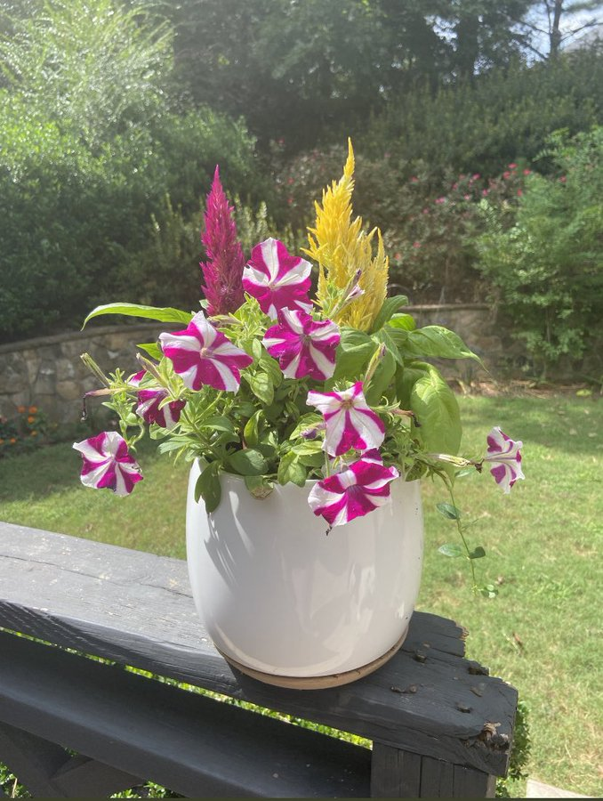

# flowermood

Mood Garden — a webcam-driven plant growth toy. A Python process reads facial
expression and streams `valence`/`calm` signals over UDP to a Unity scene that
grows, blooms, and wilts a single flower in response.

Phase 1 spec: `docs/mood_garden_spec.pdf`.

## Layout

- `python-emotion-server/` — webcam/OpenCV/mediapipe emotion signal server
- `unity/` — Unity client (URP) that renders and drives the flower
- `docs/` — spec and design notes

## Progress so far

This is the actual real-life flower (celosia + petunias) we're using as the visual
reference — the goal is a Unity flower that blooms like this when you're happy and
wilts/browns when you're not.

**Working:**
- Python emotion server reads the webcam, computes `valence` (smile/frown) and
  `calm` (stillness), and streams them over UDP at 10Hz. Auto-detects the right
  camera index since macOS shuffles indices around (built-in cam vs. iPhone
  Continuity Camera).
- Unity receives the UDP packets (`UdpReceiver` + `EmotionState`) and confirms
  values live in the Console.
- Generated a 3D model of the flower/pot from the reference photo (via Meshy,
  image-to-3D), textured with the real colors, imported into Unity.
- `FlowerController` accumulates `bloomAmount` from sustained valence (not
  snapping — has to hold a smile/frown for a bit to visibly move) and drives:
  - a scale multiplier (bigger when blooming, smaller when wilting)
  - a color tint lerp (true colors when blooming, browner when wilting)

**Known limitation:** the generated model is one single fused mesh (pot + plant
all as one piece), so we can't bend/droop just the stem independently — rotating
anything tips the whole pot over, which looks wrong. Tilt is currently disabled
because of this.

**Next up:** split the model into separate objects (pot vs. plant, maybe
per-stem) so wilting can actually droop the plant without moving the pot —
either by regenerating just the plant alone and pairing it with a simple pot
model, or splitting the current mesh apart in Blender. Then re-enable a droop
rotation on just the plant piece.
